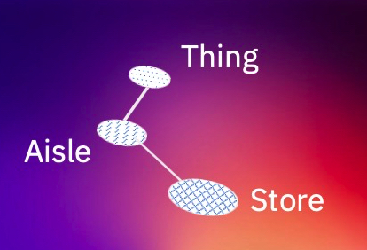
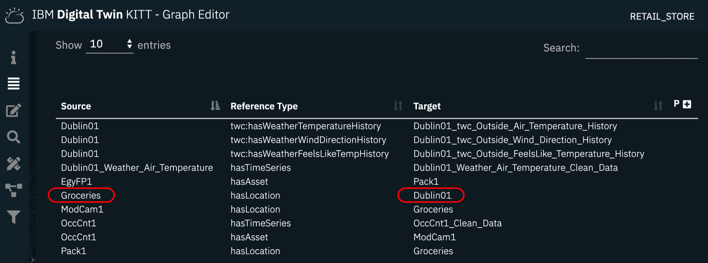
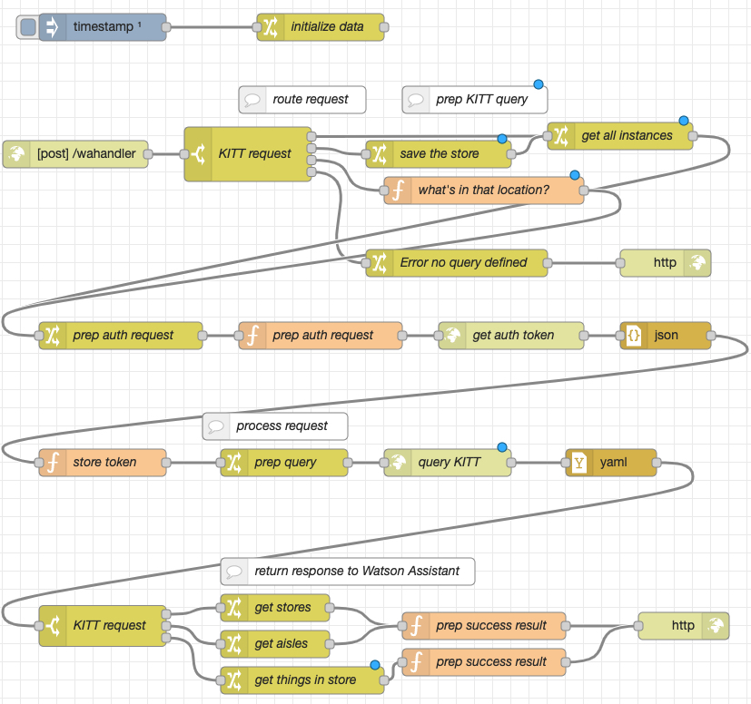
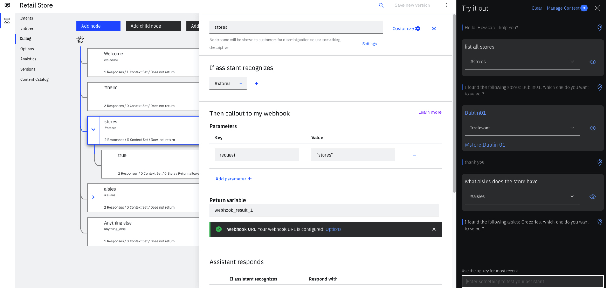

# Introduction
Graph databases can be used to control chatbots, transfer knowledge between chatbot solutions, bridge semantic domains etc.
This repo contains a simple technical integration between a chatbot based on the Watson Assistant service and the [KITT](https://www.ibm.com/blogs/internet-of-things/iot-digital-twins-foster-innovation/) solution that is the foundation of the Digital Twin solution of IBM Research, Dublin. 
It uses the pre-installed *Retail_Store* graph, that contains some sample data (store, aisle, sensors, etc).

Currently a basic use case is implemented traversing the graph:
- list all stores
- select one of the stores
- list all aisles of that store
- select on of the aisles
- list the things in that aisle

More complex use cases with a tighter integration of the KITT knowledge graph and the [IBM Watson Assistant](https://www.ibm.com/cloud/watson-assistant/) skill are conceivable.

# Prerequisites
It is expected that you have a KITT system that you can use. At the time of writing KITT is not a product or available for download, though. Please contact an IBM representative, if you are interested.

Ideally you have some prior knowledge of 
- IBM Watson Assistant and 
- Node-RED

# Architecture

# Steps
## KITT
It is assumed that a KITT instance is deployed, so this is not covered here. In order to use KITT you need to
- note down the url, user, password, and the graph name.

The KITT instance comes with a Retail_Store graph, we'll be using the *store* instance *Dublin01* and *aisle* instance *Grocerie*.

## Node-RED Application
Node-RED will be used as application platform.
- create a Node-RED instance and import the [Node-RED flow](node-red-flow.json) either locally (it needs to be accessible from the internet, though) or on the [IBM Cloud](https://nodered.org/docs/getting-started/ibmcloud):
- deploy the Node-RED flow
- adapt the **Initialize Data** node, enter here the KITT parameters

### Flow
In principal all requests are processed similarly. The flow consist of the following parts:

- The *initialize data* node is called upon startup of the flow and stores parameters in the global environment of the flow
- The */wahandler* node receives requests from the Watson Assistant webhook and performs request specific initialization (e.g. store the name of the request)
- Preparation of the KITT request: The *request* parameter of the HTTP request from the WA webhook controls, what KITT API will be called and what data is needed;  it also throws an error, if the request name is unknown
- Authentication via a bearer token 
- The actual KITT request
- Processing the KITT results and return them to the Watson Assistant 

## Watson Assistant
[Watson Assistant](https://www.ibm.com/cloud/watson-assistant/) is IBM's chabot platform.
- create a WA instance
- create an English skill and import the [JSON file](skill-Retail-Store.json)
- adapt the webhook: http://node-red-address/wahandler

The imolemented dialog would be:
- Chatbot: Hello. How can I help you?
- User: list all stores (intent *stores*)
- C: I found the following stores: Dublin01, which one do you want to select?
- U: Dublin01
- C: thank you
- U: what aisles are there? (intent *isles*)
- C: I found the following aisles: Groceries, which one do you want to select?
- U: Groceries

If an utterance like "show me all stores" is detected the Node-RED flow is called via a Webhook.
The child node prompts for the store name to be selected.

# Summary

# Related links
